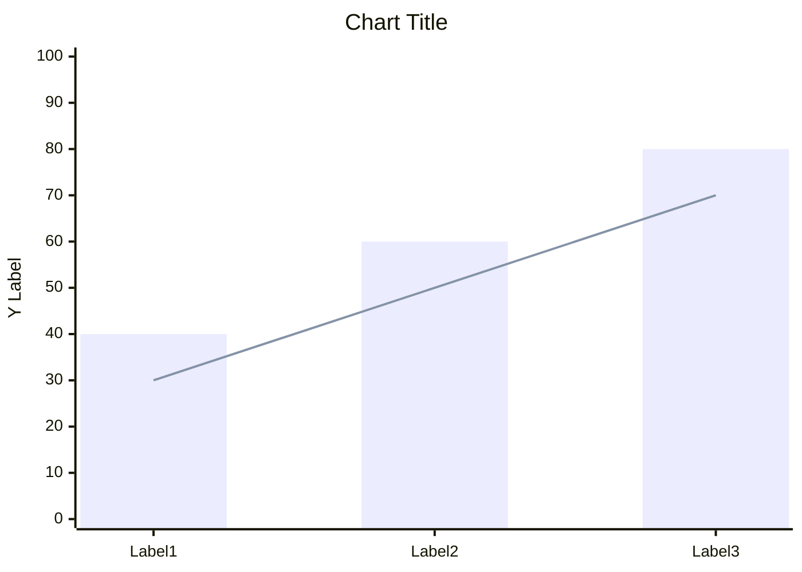
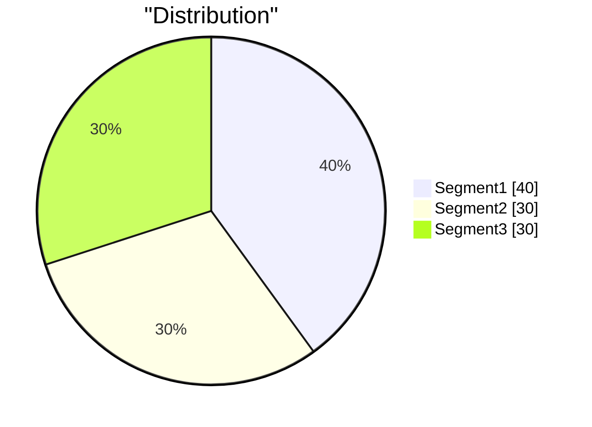
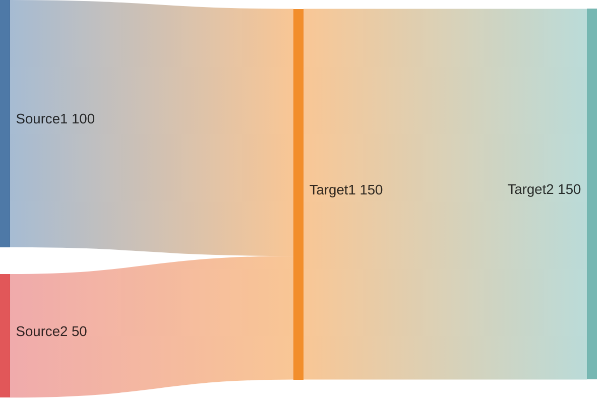
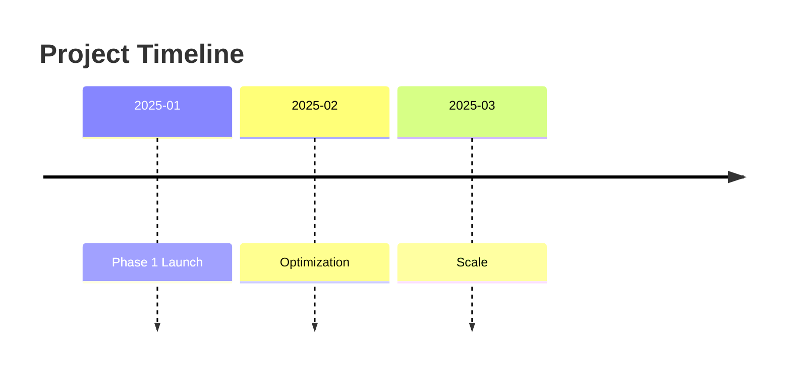
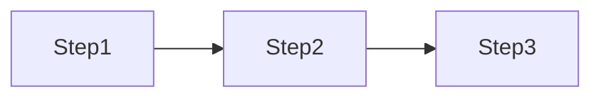

# Marketing Report Templates

## Overview

Standardized templates for marketing analytics reports. Designed for consistency, actionability, and clear data visualization using Mermaid v11+ charts.

**Key Features:**
- GA4 analytics integration
- Weekly/monthly performance tracking
- Campaign post-mortem analysis
- Mermaid v11+ chart syntax

## Quick Reference

| Template | Use Case | Frequency |
|----------|----------|-----------|
| GA4 Analytics | Website traffic & behavior | On-demand |
| Weekly Performance | Channel performance | Weekly |
| Monthly Marketing | Goal tracking & trends | Monthly |
| Campaign Post-Mortem | Campaign analysis | Post-campaign |

**Report Organization:** Activate `assets-organizing` skill for file paths.

**Analytics Reports:** `assets/reports/analytics/{date}-{report-type}.md`

---

## Insights & Recommendations Structure

All reports follow this pattern for actionable insights:

1. **Key Findings** - Evidence-backed observations with impact assessment
2. **Recommendations** - Prioritized actions with expected impact and effort
3. **Next Steps** - Actionable tasks with owners

---

## GA4 Analytics Report Template

```markdown
# [Website] Analytics Report

**Period:** [Start Date] - [End Date]
**Property:** [Property Name] (GA4: [Property ID])
**Generated:** [Date]

## Executive Summary

- **Total Active Users:** [X]
- **Total Sessions:** [X]
- **Total Page Views:** [X]
- **Avg Pages/Session:** [X]

[2-3 sentence summary of key trends]

## Traffic Trend

` ` `mermaid
xychart
    title "Daily Active Users"
    x-axis [Date1, Date2, Date3, ...]
    y-axis "Users" 0 --> [max]
    bar [value1, value2, value3, ...]
` ` `

## Geographic Distribution

` ` `mermaid
pie showData
    title "Traffic by Country"
    "Country1" : [%]
    "Country2" : [%]
    "Country3" : [%]
    "Others" : [%]
` ` `

| Country | Users | Sessions | % of Traffic |
|---------|-------|----------|--------------|
| [Country] | [X] | [X] | [X]% |

**Insight:** [Geographic analysis and opportunity]

## Traffic Sources

` ` `mermaid
pie showData
    title "Traffic Sources"
    "Direct" : [%]
    "Organic Search" : [%]
    "Paid Search" : [%]
    "Social" : [%]
    "Referral" : [%]
` ` `

| Source/Medium | Users | Sessions | % |
|---------------|-------|----------|---|
| [Source] | [X] | [X] | [X]% |

**Insights:**
- [Source performance analysis]
- [Channel opportunity]

## Top Pages

| Page | Views | % |
|------|-------|---|
| [Page] | [X] | [X]% |

**Funnel Analysis:**
- [Entry point] → [Conversion point]: [X]% conversion
- [Bottleneck identification]

## Device Breakdown

` ` `mermaid
pie showData
    title "Device Distribution"
    "Desktop" : [%]
    "Mobile" : [%]
    "Tablet" : [%]
` ` `

**Insight:** [Device-specific recommendations]

## Key Findings

1. **[Finding Title]:** [Evidence + impact]
2. **[Finding Title]:** [Evidence + impact]
3. **[Finding Title]:** [Evidence + impact]

## Recommendations

| Priority | Action | Expected Impact | Effort |
|----------|--------|-----------------|--------|
| High | [Action] | [Impact] | [Low/Med/High] |
| Medium | [Action] | [Impact] | [Low/Med/High] |
| Low | [Action] | [Impact] | [Low/Med/High] |

## Next Steps

1. [ ] [Actionable task with owner]
2. [ ] [Actionable task with owner]
3. [ ] [Actionable task with owner]

---

*Report generated using GA4 Data API*
```

## Weekly Performance Report

```markdown
# Weekly Marketing Report: [Date Range]

## Summary

` ` `mermaid
xychart
    title "Weekly Performance"
    x-axis [Mon, Tue, Wed, Thu, Fri, Sat, Sun]
    y-axis "Value" 0 --> [max]
    line [spend1, spend2, ...]
    bar [leads1, leads2, ...]
` ` `

- Total Spend: $[X]
- Total Leads: [X]
- Total Revenue: $[X]
- Overall ROAS: [X]x

## Channel Performance

` ` `mermaid
sankey
    Paid Search,[Leads],[value]
    Paid Social,[Leads],[value]
    Email,[Leads],[value]
    Organic,[Leads],[value]
` ` `

| Channel | Spend | Leads | CVR | ROAS |
|---------|-------|-------|-----|------|
| Paid Search | $[X] | [X] | [X]% | [X]x |
| Paid Social | $[X] | [X] | [X]% | [X]x |
| Email | N/A | [X] | [X]% | [X]x |
| Organic | N/A | [X] | [X]% | N/A |

## Top Performers
- Best campaign: [name] - [metric]
- Best creative: [name] - [metric]
- Best audience: [name] - [metric]

## Issues/Blockers
- [Issue and action taken]

## Next Week Focus
- [ ] [Priority 1]
- [ ] [Priority 2]
```

## Monthly Marketing Report

```markdown
# Monthly Marketing Report: [Month Year]

## Executive Summary
[3-5 bullet points on key findings]

## Performance vs Goals

` ` `mermaid
xychart
    title "Goal vs Actual"
    x-axis [Revenue, Leads, CAC, ROAS]
    y-axis "%" 0 --> 150
    bar "Goal" [100, 100, 100, 100]
    bar "Actual" [X, X, X, X]
` ` `

| Metric | Goal | Actual | % | Status |
|--------|------|--------|---|--------|
| Revenue | $[X] | $[X] | [X]% | [emoji] |
| Leads | [X] | [X] | [X]% | [emoji] |
| CAC | $[X] | $[X] | [X]% | [emoji] |
| ROAS | [X]x | [X]x | [X]% | [emoji] |

## Month-over-Month Trends

` ` `mermaid
xychart
    title "MoM Comparison"
    x-axis [Week1, Week2, Week3, Week4]
    y-axis "Users" 0 --> [max]
    line "This Month" [v1, v2, v3, v4]
    line "Last Month" [v1, v2, v3, v4]
` ` `

## Channel Deep Dive

### Paid Media
` ` `mermaid
pie showData
    title "Paid Media Spend"
    "Google Ads" : [%]
    "Facebook" : [%]
    "Other" : [%]
` ` `
[Performance, insights, optimizations]

### Email Marketing
[Performance, insights, optimizations]

### Content/SEO
[Performance, insights, optimizations]

### Social Media
[Performance, insights, optimizations]

## Key Learnings
1. [Learning + evidence]
2. [Learning + evidence]

## Next Month Plan
| Initiative | Expected Impact | Owner |
|------------|-----------------|-------|
| [Action] | [Impact] | [Name] |

## Budget Allocation Recommendation
| Channel | Current | Proposed | Change |
|---------|---------|----------|--------|
| [Channel] | $[X] | $[X] | [+/-X]% |
```

## Campaign Post-Mortem

```markdown
# Campaign Report: [Campaign Name]

## Overview

` ` `mermaid
timeline
    title Campaign Timeline
    [Start Date] : Launch
    [Mid Date] : Optimization
    [End Date] : Completion
` ` `

- Duration: [dates]
- Objective: [goal]
- Budget: $[X]

## Results

` ` `mermaid
xychart
    title "Target vs Actual"
    x-axis [Impressions, Clicks, Conversions, Revenue]
    y-axis "%" 0 --> 150
    bar "Target" [100, 100, 100, 100]
    bar "Actual" [X, X, X, X]
` ` `

| Metric | Target | Actual | Variance |
|--------|--------|--------|----------|
| [Metric] | [X] | [X] | [+/-X]% |

## Funnel Analysis

` ` `mermaid
flowchart LR
    A[Impressions: X] --> B[Clicks: X]
    B --> C[Leads: X]
    C --> D[Sales: X]

    style A fill:#e1f5fe
    style D fill:#c8e6c9
` ` `

## What Worked
- [Successful element + why]

## What Didn't Work
- [Failed element + why]

## Key Learnings
1. [Insight + evidence]

## Recommendations
| Action | Priority | Expected Impact |
|--------|----------|-----------------|
| [Action] | [High/Med/Low] | [Impact] |
```

---

## Mermaid v11+ Chart Reference

### Bar/Line Charts (xychart)



**Options:**
- `xychart horizontal` - horizontal orientation
- Multiple `bar` and `line` series supported

### Pie Charts



### Sankey Diagrams



**Options:**
- `linkColor: "source"` | `"target"` | `"gradient"` | hex
- `nodeAlignment: "justify"` | `"center"` | `"left"` | `"right"`
- `showValues: true`

### Timeline Diagrams



### Flowcharts



---

**Sources:**
- [Mermaid XY Chart](https://mermaid.js.org/syntax/xyChart.html)
- [Mermaid Pie Chart](https://mermaid.js.org/syntax/pie.html)
- [Mermaid Sankey](https://mermaid.js.org/syntax/sankey.html)
- [Mermaid Timeline](https://mermaid.js.org/syntax/timeline.html)
